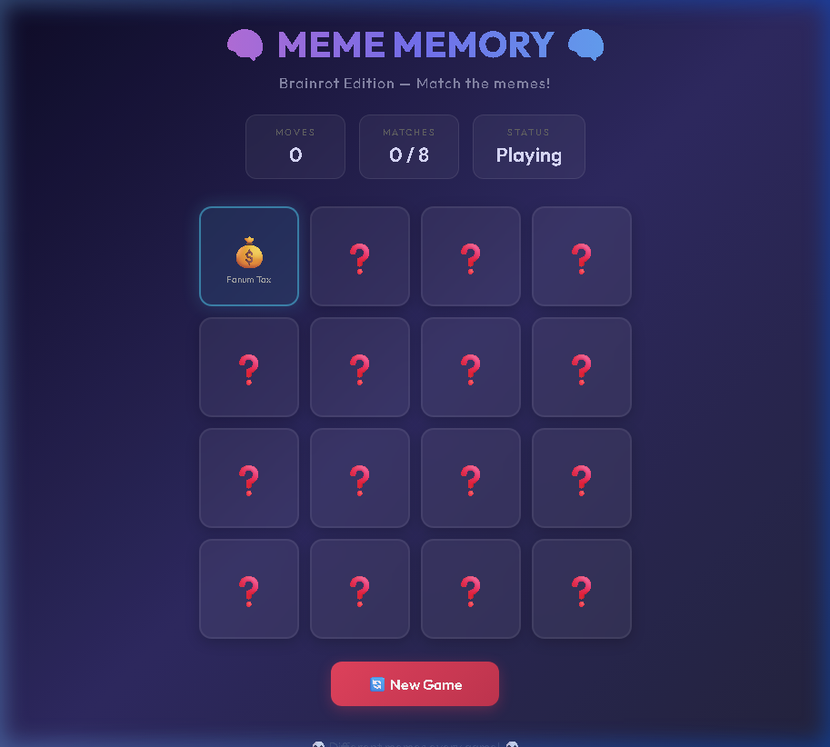

# 🧠 Meme Memory (Brainrot Edition)

A premium, glassmorphism-styled memory matching card game featuring the internet's most infamous brainrot memes.



## ⚡ Try It

Open the game directly in your browser to start matching:
*   **Open index.html**
*   *Or spin up a local development server using the Quick Start guide below.*

---

## 🚀 Quick Start

No installations, no npm builds, and no external dependencies required. 

```bash
# Double-click index.html or launch it directly from your terminal:
start index.html      # On Windows (CMD/PowerShell)
open index.html       # On macOS
xdg-open index.html   # On Linux
```

---

## ✨ Features

*   **🃏 35 Brainrot Meme Pool:** Every game randomly selects 8 pairs (16 cards, 4x4 grid) from a custom pool of 35 legendary internet memes (from *Skibidi Toilet* and *GigaChad* to *Mewing* and *Fanum Tax*), making every session unique.
*   **💎 Ultra-Premium Glassmorphism UI:** Stunning frosted glass card design with CSS backdrop-filters, custom glowing gradients, and smooth responsive hover animations.
*   **🔒 State-Locked Flip Logic:** A bulletproof matching state machine that locks user interactions during verification, preventing double-click cheats or timing breaks.
*   **📊 Live Stats Dashboard:** Real-time feedback showing total moves, matched pairs progress, and active game status.
*   **🏆 Custom Win Overlay:** Interactive end-of-game overlay summarizing your performance with a frictionless play-again loop.

---

## 🛠️ How to Run Locally

If you prefer to serve the application over HTTP rather than opening local HTML files:

### 1. Requirements
*   Any modern web browser (Chrome, Firefox, Safari, Edge).
*   *Optional:* Node.js (for `http-server`) or Python (for built-in HTTP server).

### 2. Launch Local Server
Run any of the following commands in the project directory:

```bash
# Option A: Using Python (Built-in on most machines)
python -m http.server 8080

# Option B: Using Node/NPM
npx http-server -p 8080
```

Once running, navigate to `http://localhost:8080` in your browser.

---

## 🧠 How It Works

### High Entropy Shuffle Algorithm
To guarantee replayability, the game implements a two-stage shuffle using a standard **Fisher-Yates Shuffle**. First, the master array of 35 memes is randomized to slice out 8 unique memes. Next, those selected memes are duplicated into pairs and shuffled a second time to build the random card board.

### Safe Flip State Management
Instead of relying on timers that can be bypassed by rapid clicking, the JavaScript uses a boolean locking flag (`isLocked`):
```javascript
function flipCard(el, index) {
    if (isLocked || el.classList.contains('flipped') || el.classList.contains('matched')) return;
    // ...
}
```
This flag is set to `true` the millisecond two cards are flipped, and released only when the mismatch timeout finishes or a match is locked in place. This guarantees that user interactions never desynchronize with underlying game state variables.

---

## 🎓 Credits & Acknowledgements

*   **Google Fonts:** Styled with the elegant and modern [Outfit](https://fonts.google.com/specimen/Outfit) font family.
*   **Emojis & Memes:** Powered by Unicode emojis and internet meme culture.